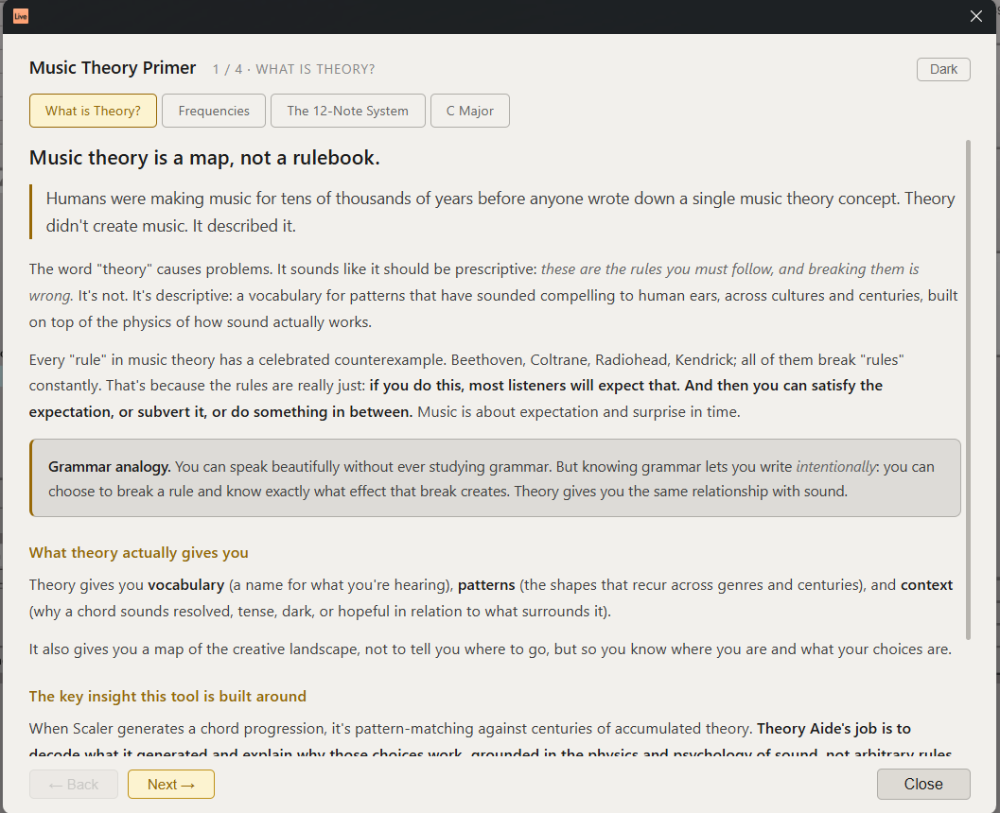
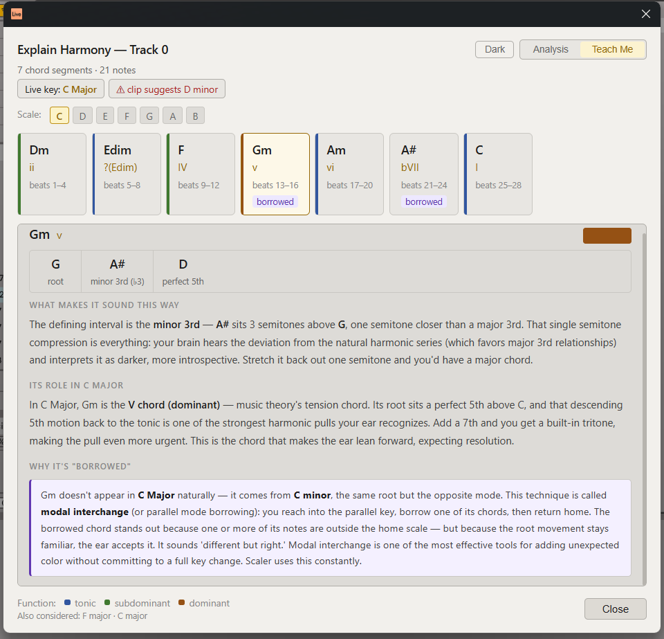
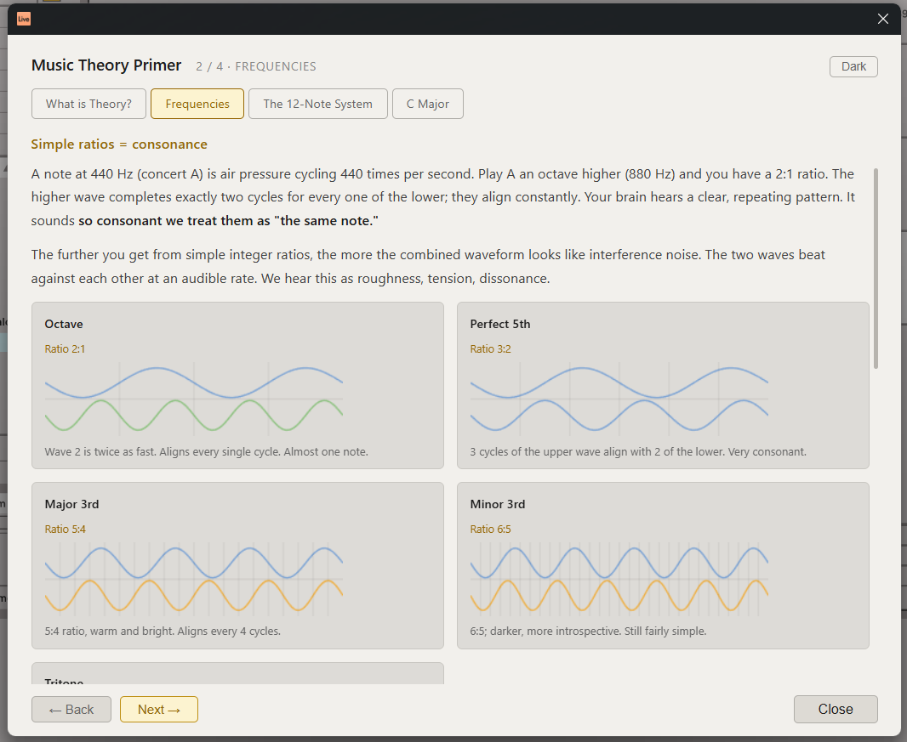

# Theory Aide

Theory Aide is an Ableton Live extension for understanding what your MIDI is doing musically. It analyzes harmony, rhythm, voicing, density, motion, form, and tension, and then turns that analysis into clear explanations and practical next steps.

The goal is not to judge whether an idea is correct or good. The goal is to help producers understand why an ideas work for them, why you may feels stuck, and things that you can try before throwing the idea away.

Theory Aide is built for the moment after you generate or write something interesting and ask, “What now?” It can explain the harmonic timeline, identify chord function, show tension and density over time, inspect rhythm and phrasing, flag muddy voicings, compare song sections, and suggest ways to develop the material into a verse, chorus, bridge, build, breakdown, or resolution.

The extension treats theory as a creative lens, not a rulebook. It connects traditional concepts like Roman numerals modal theory with producer focused concepts like groove, register, frequency space, texture, automation, and arrangement energy.

I am trying to make music theory useful inside the writing process.

It is not meant to replace taste. It is meant to support you and make you more confident in your ability to express creativity.

See [DESIGN.md](DESIGN.md) for the full positioning and roadmap, and
[CHANGELOG.md](CHANGELOG.md) for release history.





**No Python required.** The entire theory engine is TypeScript, bundled into
`dist/extension.js`.

## Commands

All commands appear in the right-click context menu inside Live's arrangement or session view.

### Arrangement selection (right-click a MIDI track with a time selection)

| Command | What it does |
| --- | --- |
| **Harmonic Timeline (All Tracks)…** | First lets you pick which tracks to include (drum/percussion is auto-detected and pre-unchecked). Then slices the combined harmony beat by beat and shows the chord/Roman-numeral timeline with function colors (T/S/D), borrowed and secondary-dominant badges, and per-track clash warnings. Toggle **Single view** for one continuous, scrollable list instead of paging. |
| **Counterpoint Checker…** | First lets you pick which tracks to compare (drum/percussion tracks are auto-detected and pre-unchecked). Then analyzes every pair of selected MIDI tracks for parallel 5ths, parallel octaves, hidden 5ths/octaves, and parallel unisons. Reports the motion-type breakdown (contrary / oblique / similar / parallel) and harmonic interval distribution per pair and in aggregate. |
| **Composition Dimensions (Selection)…** | Rates the selection across vertical (harmony), horizontal (melody), macro (arrangement energy), and spectral (register) dimensions. |
| **Arrangement And Form…** | Detects section structure, energy arcs, and formal landmarks in the selected range. |
| **Composition Map (Selection)…** | Visual overview of harmonic and rhythmic density over the selected time range. |

### MIDI clip (right-click a clip)

| Command | What it does |
| --- | --- |
| **Explain Harmony…** | Chord-by-chord analysis in Live's current key: Roman numerals, function colors, borrowed/secondary badges, out-of-key flags, and key candidates with scores. Includes a **Teach Me** mode with prose explanations. |
| **Voicing And Density…** | Flags muddy register overlap, spread issues, and density spikes within a single clip. |
| **Rhythm And Phrasing…** | Analyzes rhythmic grid alignment, phrase shape, groove, and breath points. |
| **Timbre Texture Dynamics…** | Inspects velocity contour, articulation patterns, and textural density over time. |
| **Composition Dimensions (Clip)…** | Same dimension breakdown as the arrangement version, scoped to one clip. |
| **Composition Map (Clip)…** | Harmonic and rhythmic map scoped to one clip. |
| **Tone Row Checker…** | Twelve-tone / serial analysis of a clip. Detects the prime row (P0), builds the full 12×12 Babbitt matrix with hexachord color coding, computes the interval vector, tests for I- and R-combinatoriality, lists all 48 row forms, and annotates the clip's pitch-class sequence against detected row statements. |
| **What Do I Do Next?…** | Suggests concrete next moves (verse, chorus, bridge, breakdown, resolution) based on the clip's harmonic and rhythmic state. |
| **Theory Reference…** | Key-aware cheat sheet: scale, diatonic chords with jazz context, common progressions, borrowed/secondary chords, and all seven modes. |
| **Music Theory Primer…** | Introductory explainer covering frequencies, the 12-note system, and the current key. |

### Scene (right-click a scene)

| Command | What it does |
| --- | --- |
| **Audit Session…** | Scans every MIDI clip in the session for out-of-key notes and key-center disagreements. |
| **Theory Reference…** | Same reference modal as above. |
| **Music Theory Primer…** | Same primer as above. |

When Live's **Scale Mode** is on, analysis uses Live's key and warns if the content
actually suggests a different key. Otherwise the key is inferred
(scale-membership scoring, shown transparently with candidate scores).

## Building

Requires Node.js ≥ 24, the SDK `.tgz` packages (expected in
`extensions-sdk-1.0.0-beta.0/` at the repo root), and a Live build with the
Extensions platform + Developer Mode for `npm start`.

```bash
npm install
npm run build      # type-check + bundle → dist/extension.js
npx tsx tests/smoke.ts   # engine smoke tests
npm start          # build + load into Live (needs .env with EXTENSION_HOST_PATH)
npm run package    # production .ablx
```

## Layout

```
src/
  extension.ts              commands, context menus, note extraction
  theory/data.ts            chord/scale tables
  theory/core.ts            Scale, Chord, diatonic builder, chord recognition
  theory/analyzer.ts        key inference, Roman numerals, harmonic function
  theory/timeline.ts        cross-track segmentation, clash detection
  theory/counterpoint.ts    parallel/hidden interval detection, motion texture
  theory/tonerow.ts         twelve-tone row detection, matrix, combinatoriality
  theory/dimensions.ts      composition dimension scoring
  theory/form.ts            arrangement form and section detection
  theory/map.ts             composition map data
  theory/nextMoves.ts       guided next-move suggestions
  theory/rhythm.ts          rhythm and phrasing analysis
  theory/timbre.ts          timbre, texture, and dynamics analysis
  theory/voicing.ts         voicing density and register analysis
  *.html                    modal UIs (one per command)
tests/smoke.ts              engine assertions
```

MIT © 2026 saarsena
